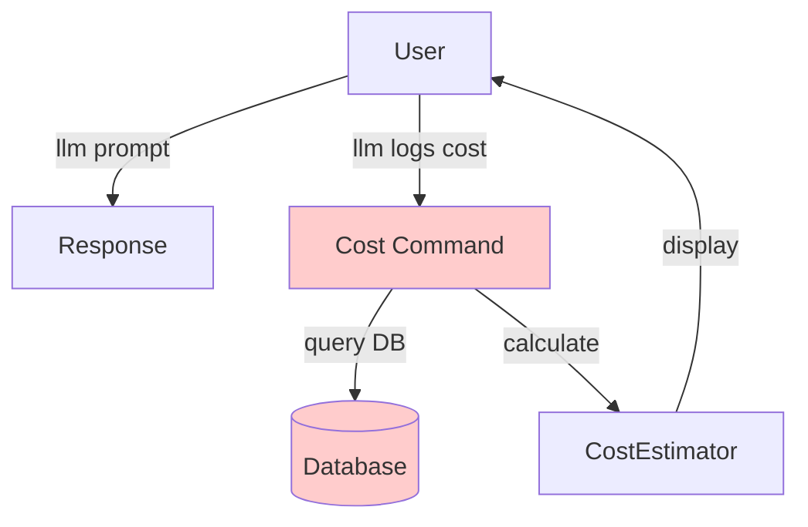
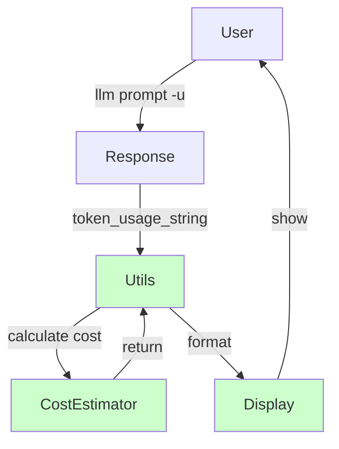

# Original vs Revised Plan - Side-by-Side Comparison

## CLI Approach

### Original Plan ❌
```bash
# Separate cost command
llm "Hello" -m gpt-4
llm logs cost -1

# Multiple new commands
llm cost-update
llm cost-models
llm logs cost --total --group-by model
```

**Issues:**
- More commands to learn
- Separate workflow
- Extra code to maintain
- Less intuitive

### Revised Plan ✅
```bash
# Integrated with usage
llm "Hello" -m gpt-4 -u
# Shows tokens AND cost together

# Same for logs
llm logs -1 -u
# Shows tokens AND cost together
```

**Benefits:**
- Natural integration
- Users already know -u flag
- Less code
- Better UX

## Architecture Comparison

### Original Plan


### Revised Plan


## Code Changes

### Original Plan
| File | Lines Changed | New Commands |
|------|---------------|--------------|
| llm/costs.py | ~300 | - |
| llm/models.py | ~30 | - |
| llm/cli.py | **~200** | **3 new** |
| llm/utils.py | ~0 | - |
| **Total** | **~530** | **3 new** |

### Revised Plan
| File | Lines Changed | New Commands |
|------|---------------|--------------|
| llm/costs.py | ~300 | - |
| llm/models.py | ~30 | - |
| llm/cli.py | **~20** | **0 new** |
| llm/utils.py | **~40** | - |
| **Total** | **~390** | **0 new** |

**26% less code, no new commands!**

## User Experience

### Original Plan
```
User: How much did that cost?
1. Run: llm "prompt" -m gpt-4
2. Remember to check cost
3. Run: llm logs cost -1
4. See the cost

Total: 2 commands
```

### Revised Plan
```
User: How much did that cost?
1. Run: llm "prompt" -m gpt-4 -u
2. See tokens AND cost immediately

Total: 1 command
```

## Feature Comparison

| Feature | Original | Revised | Notes |
|---------|----------|---------|-------|
| Cost calculation | ✅ | ✅ | Core feature |
| Response.cost() API | ✅ | ✅ | Python API |
| Show cost in CLI | ✅ | ✅ | Different approach |
| Historical pricing | ✅ | ✅ | Unchanged |
| Fuzzy model matching | ✅ | ✅ | Unchanged |
| Cached token support | ✅ | ✅ | Unchanged |
| `llm logs cost` | ✅ | ❌ | Use -u instead |
| `llm cost-update` | ✅ | ❌ | Future feature |
| `llm cost-models` | ✅ | ❌ | Future feature |
| Cost aggregation | ✅ | ❌ | Future feature |
| Auto-update cache | ✅ | ❌ | Start simple |

## What You Get With -u Flag

### Before (current behavior)
```bash
$ llm "Hello" -m gpt-4 -u
Hello! How can I help you today?

Token usage: 10 input, 5 output
```

### After (revised plan)
```bash
$ llm "Hello" -m gpt-4 -u
Hello! How can I help you today?

Token usage: 10 input, 5 output, Cost: $0.000450 ($0.000300 input, $0.000150 output)
```

**Exactly what users want to know!**

## Implementation Complexity

### Original Plan
```
Phase 1: Core ████████░░ 80%
Phase 2: Integration ████████░░ 80%
Phase 3: CLI Commands █████████░ 90%  ← Complex!
Phase 4: Polish ██████░░░░ 60%

Overall: ████████░░ 80%
```

### Revised Plan
```
Phase 1: Core ████████░░ 80%
Phase 2: Integration ████████░░ 80%
Phase 3: CLI Enhancement ████░░░░░░ 40%  ← Simpler!
Phase 4: Polish ██████░░░░ 60%

Overall: ██████░░░░ 65%
```

## Maintenance Burden

### Original Plan
**New commands to maintain:**
- `llm logs cost` - Argument parsing, formatting, filtering
- `llm cost-update` - Network requests, error handling
- `llm cost-models` - Listing, filtering, formatting

**Result:** 3 new command surfaces × ongoing maintenance

### Revised Plan
**Modified existing behavior:**
- `token_usage_string()` - Add optional parameters
- Already tested, already documented
- Small incremental change

**Result:** Minimal maintenance increase

## Testing Effort

### Original Plan
```
Unit tests: ████████░░ 40 tests
CLI tests: ██████████ 15 tests  ← 3 new commands
Integration: ████░░░░░░ 8 tests
Total: ~63 tests
```

### Revised Plan
```
Unit tests: ████████░░ 40 tests
CLI tests: ████░░░░░░ 5 tests   ← Modify existing
Integration: ████░░░░░░ 8 tests
Total: ~53 tests
```

**16% fewer tests needed!**

## Documentation Impact

### Original Plan
**New pages:**
- CLI reference for 3 new commands
- Usage examples for each command
- Integration guide

**Updates:**
- README with new commands
- CLI reference
- Logging docs

### Revised Plan
**Updates only:**
- Update -u/--usage documentation
- Add cost examples to existing pages
- README with -u example

**No new pages needed!**

## Decision Matrix

| Criteria | Original | Revised | Winner |
|----------|----------|---------|--------|
| Code simplicity | 3/5 | 5/5 | ✅ Revised |
| User experience | 3/5 | 5/5 | ✅ Revised |
| Maintenance | 2/5 | 5/5 | ✅ Revised |
| Features | 5/5 | 4/5 | Original |
| Testing | 3/5 | 5/5 | ✅ Revised |
| Documentation | 3/5 | 5/5 | ✅ Revised |
| **Total** | **19/30** | **29/30** | **🏆 Revised** |

## Summary

### Why Revised Plan Wins

1. **26% less code** - Fewer bugs, easier maintenance
2. **Better UX** - Cost appears when users want it
3. **0 new commands** - Nothing new to learn
4. **16% fewer tests** - Faster to implement
5. **Natural fit** - Enhances existing feature

### What We're NOT Losing

- Core cost calculation ✅
- Python API ✅
- Historical pricing ✅
- Fuzzy matching ✅
- All essential features ✅

### What We're Deferring

- Cost aggregation → Future
- Auto-updates → Future
- Model listing → Future
- Advanced reporting → Future

**All can be added later without breaking changes!**

## Recommendation

**Implement the Revised Plan** ✅

It delivers the core value (cost estimation) with significantly less complexity, better UX, and easier maintenance. Advanced features can be added later based on user feedback.

---

**Winner: Revised Plan** 🎉
