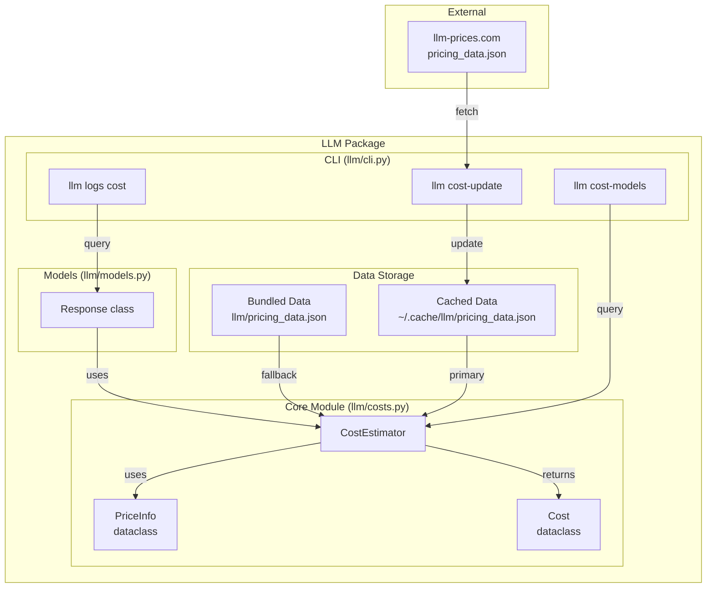
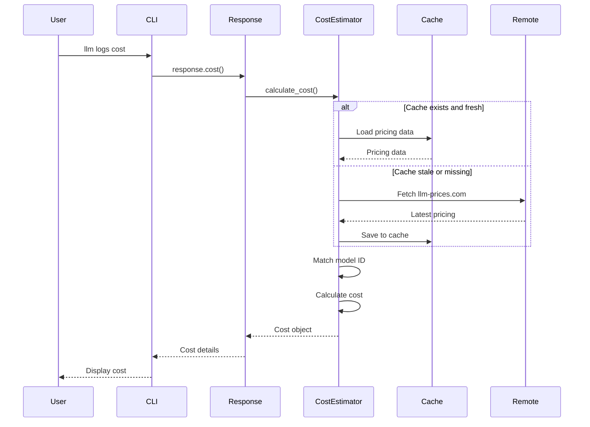
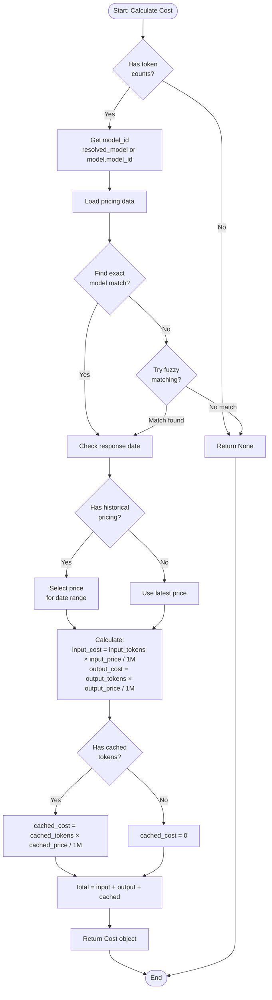
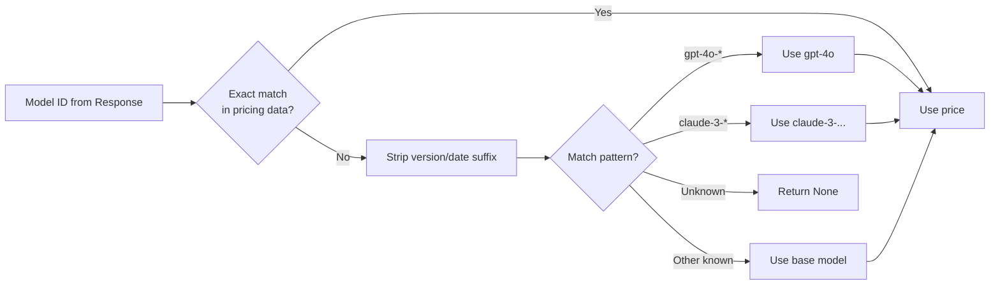

# Cost Estimation Architecture

## Component Diagram

```mermaid
graph TB
    subgraph External
        PD[llm-prices.com<br/>pricing_data.json]
    end
    
    subgraph "LLM Package"
        subgraph "Core Module (llm/costs.py)"
            CE[CostEstimator]
            PI[PriceInfo<br/>dataclass]
            CO[Cost<br/>dataclass]
        end
        
        subgraph "Models (llm/models.py)"
            R[Response class]
            R -->|uses| CE
        end
        
        subgraph "CLI (llm/cli.py)"
            LC[llm logs cost]
            CU[llm cost-update]
            CM[llm cost-models]
        end
        
        subgraph "Data Storage"
            BD[Bundled Data<br/>llm/pricing_data.json]
            CD[Cached Data<br/>~/.cache/llm/pricing_data.json]
        end
    end
    
    PD -->|fetch| CU
    CU -->|update| CD
    BD -->|fallback| CE
    CD -->|primary| CE
    LC -->|query| R
    CM -->|query| CE
    CE -->|returns| CO
    CE -->|uses| PI
```

## Data Flow

```mermaid
sequenceDiagram
    participant User
    participant CLI
    participant Response
    participant CostEstimator
    participant Cache
    participant Remote
    
    User->>CLI: llm logs cost
    CLI->>Response: response.cost()
    Response->>CostEstimator: calculate_cost()
    
    alt Cache exists and fresh
        CostEstimator->>Cache: Load pricing data
        Cache-->>CostEstimator: Pricing data
    else Cache stale or missing
        CostEstimator->>Remote: Fetch llm-prices.com
        Remote-->>CostEstimator: Latest pricing
        CostEstimator->>Cache: Save to cache
    end
    
    CostEstimator->>CostEstimator: Match model ID
    CostEstimator->>CostEstimator: Calculate cost
    CostEstimator-->>Response: Cost object
    Response-->>CLI: Cost details
    CLI-->>User: Display cost
```

## Cost Calculation Logic

```mermaid
flowchart TD
    Start([Start: Calculate Cost]) --> HasTokens{Has token<br/>counts?}
    
    HasTokens -->|No| ReturnNone[Return None]
    HasTokens -->|Yes| GetModelID[Get model_id<br/>resolved_model or model.model_id]
    
    GetModelID --> LoadPricing[Load pricing data]
    LoadPricing --> MatchModel{Find exact<br/>model match?}
    
    MatchModel -->|Yes| CheckDate[Check response date]
    MatchModel -->|No| TryFuzzy{Try fuzzy<br/>matching?}
    
    TryFuzzy -->|Match found| CheckDate
    TryFuzzy -->|No match| ReturnNone
    
    CheckDate --> Historical{Has historical<br/>pricing?}
    
    Historical -->|Yes| SelectPrice[Select price<br/>for date range]
    Historical -->|No| UseLatest[Use latest price]
    
    SelectPrice --> Calculate
    UseLatest --> Calculate
    
    Calculate[Calculate:<br/>input_cost = input_tokens × input_price / 1M<br/>output_cost = output_tokens × output_price / 1M]
    
    Calculate --> HasCached{Has cached<br/>tokens?}
    
    HasCached -->|Yes| CalcCached[cached_cost = cached_tokens × cached_price / 1M]
    HasCached -->|No| NoCached[cached_cost = 0]
    
    CalcCached --> SumTotal
    NoCached --> SumTotal
    
    SumTotal[total = input + output + cached] --> Return[Return Cost object]
    Return --> End([End])
    ReturnNone --> End
```

## Model ID Matching Strategy

```mermaid
flowchart LR
    Input[Model ID from Response] --> Exact{Exact match<br/>in pricing data?}
    
    Exact -->|Yes| Found[Use price]
    Exact -->|No| Strip[Strip version/date suffix]
    
    Strip --> Pattern{Match pattern?}
    
    Pattern -->|gpt-4o-*| UseBase1[Use gpt-4o]
    Pattern -->|claude-3-*| UseBase2[Use claude-3-...]
    Pattern -->|Other known| UseBase3[Use base model]
    Pattern -->|Unknown| NotFound[Return None]
    
    UseBase1 --> Found
    UseBase2 --> Found
    UseBase3 --> Found
```

